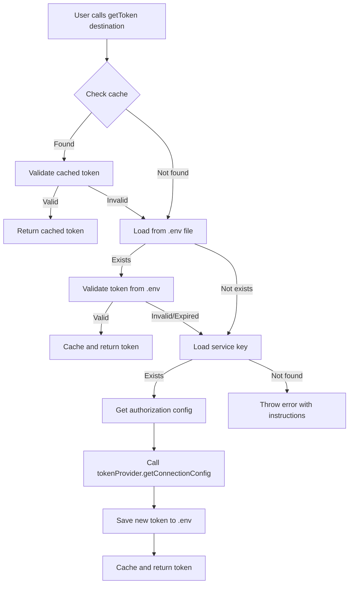
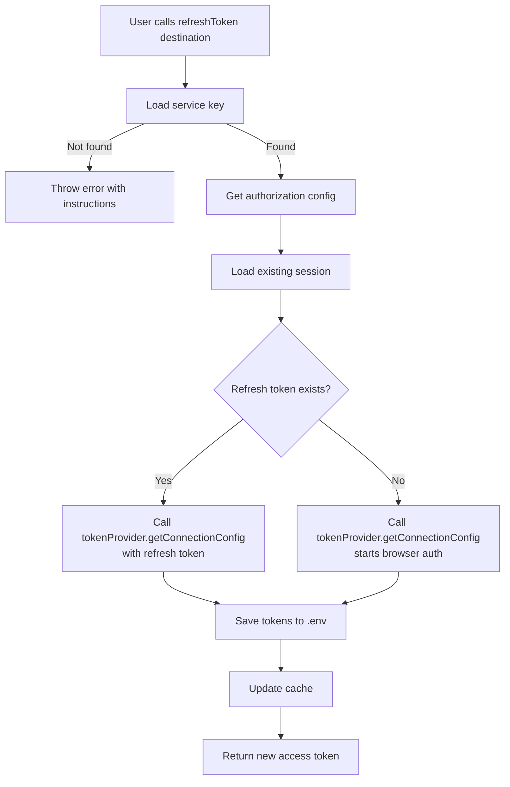
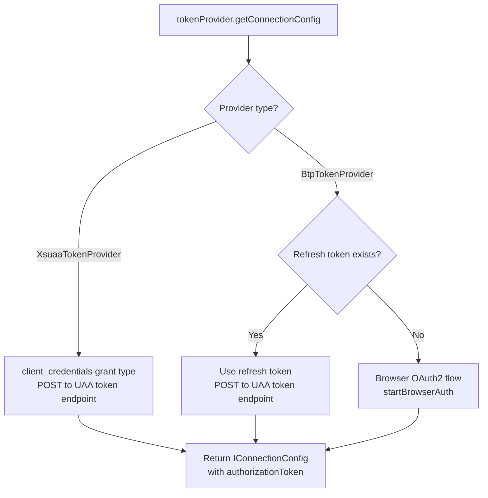
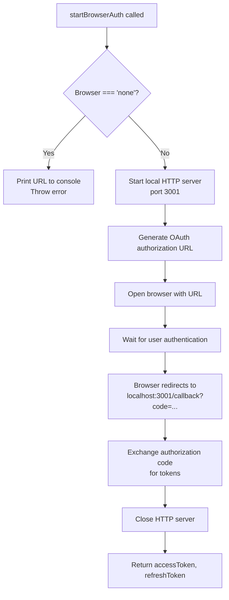

# Architecture

This document describes the architecture and design decisions of the `@mcp-abap-adt/auth-broker` package.

## Overview

The `auth-broker` package provides JWT token management for SAP ABAP ADT systems and BTP services. It handles token loading, validation, refresh, and authentication flows for:
- **ABAP systems** - Traditional ABAP systems with browser-based OAuth2
- **XSUAA** - BTP services with reduced scope (client_credentials grant type)
- **BTP** - ABAP systems in BTP with full scope (browser-based OAuth2)

## Core Components

### AuthBroker Class

The main class that orchestrates all authentication operations.

**Location**: `src/AuthBroker.ts`

**Responsibilities**:
- Token retrieval and caching
- Token validation
- Token refresh coordination
- Browser authentication flow
- Environment file management

### Component Modules

#### Path Resolver (`src/pathResolver.ts`)
Resolves search paths for `.env` and `.json` files:
- Handles constructor parameters
- Reads `AUTH_BROKER_PATH` environment variable
- Falls back to current working directory
- Supports multiple paths (colon/semicolon-separated)

#### Environment Loaders
Load configuration from `{destination}.env` files:
- **AbapSessionStore** (`src/stores/AbapSessionStore.ts`) - For ABAP sessions
  - Uses `loadEnvFile()` to parse `SAP_*` environment variables
  - Extracts JWT token, refresh token, UAA credentials
  - Handles optional fields (client, language)
- **XsuaaSessionStore** (`src/stores/XsuaaSessionStore.ts`) - For XSUAA sessions
  - Uses `loadXsuaaEnvFile()` to parse `XSUAA_*` environment variables
  - Extracts JWT token, optional refresh token, UAA credentials
  - MCP URL is optional (not part of authentication)
- **BtpSessionStore** (`src/stores/BtpSessionStore.ts`) - For BTP sessions
  - Uses `loadBtpEnvFile()` to parse `BTP_*` environment variables
  - Extracts JWT token, refresh token, UAA credentials, ABAP URL
  - All parameters (except tokens) come from service key

#### Service Key Loaders
Load service keys from `{destination}.json` files:
- **AbapServiceKeyStore** (`src/stores/AbapServiceKeyStore.ts`) - For ABAP service keys
  - Validates JSON structure with nested `uaa` object
  - Extracts UAA configuration
  - Extracts SAP URL (supports multiple formats: `url`, `abap.url`, `sap_url`)
- **XsuaaServiceKeyStore** (`src/stores/XsuaaServiceKeyStore.ts`) - For XSUAA service keys
  - Validates direct XSUAA format (UAA credentials at root level)
  - Uses `XsuaaServiceKeyParser` to parse service keys
  - Prioritizes `apiurl` over `url` for UAA authorization

#### Token Validator (`src/tokenValidator.ts`)
Validates JWT tokens by testing connection to SAP system:
- Makes test request to SAP ADT discovery endpoint
- Handles 401/403 errors (distinguishes expired tokens from permission errors)
- Returns boolean validation result

#### Token Refresher (`src/tokenRefresher.ts`)
Refreshes JWT tokens using OAuth2 refresh token flow:
- Uses UAA OAuth endpoint
- Exchanges refresh token for new access token
- Returns new tokens

#### Browser Auth (`src/browserAuth.ts`)
Handles browser-based OAuth2 flow for initial token acquisition:
- Starts local HTTP server for OAuth callback
- Opens browser with authorization URL (configurable: chrome, edge, firefox, system, none)
- If `browser === 'none'`, prints URL to console for manual copy
- Waits for user authentication
- Exchanges authorization code for tokens
- Handles OAuth2 error parameters (`error`, `error_description`)

#### Client Credentials Auth (`src/clientCredentialsAuth.ts`)
Handles client_credentials grant type for XSUAA authentication:
- Uses POST request to UAA token endpoint
- No browser interaction required
- Suitable for server-to-server communication

#### Cache (`src/cache.ts`)
In-memory token caching:
- Stores tokens per destination
- Provides cache management methods
- Thread-safe (single-threaded Node.js)

#### Service Key Parsers
Modular parser architecture for different service key formats:
- **IServiceKeyParser** (`src/parsers/IServiceKeyParser.ts`) - Interface for parsers
- **AbapServiceKeyParser** (`src/parsers/AbapServiceKeyParser.ts`) - Parses standard ABAP service keys
- **XsuaaServiceKeyParser** (`src/parsers/XsuaaServiceKeyParser.ts`) - Parses direct XSUAA service keys

#### Session Stores
Different store implementations for different session types:
- **AbapSessionStore** - File-based store for ABAP sessions (uses `SAP_*` variables)
- **XsuaaSessionStore** - File-based store for XSUAA sessions (uses `XSUAA_*` variables)
- **BtpSessionStore** - File-based store for BTP sessions (uses `BTP_*` variables)
- **SafeAbapSessionStore** - In-memory store for ABAP sessions
- **SafeXsuaaSessionStore** - In-memory store for XSUAA sessions
- **SafeBtpSessionStore** - In-memory store for BTP sessions

## Authentication Flow

### 1. getToken() Flow



### 2. refreshToken() Flow



### 3. Token Provider Flow



### 4. Browser Authentication Flow



## File System Structure

### Environment File Format

`{destination}.env` file structure:

```env
# Token Expiry Information (auto-generated)
# JWT Token expires: Monday, December 1, 2025, 10:30:00 AM (UTC)
# JWT Token expires at: 2025-12-01T10:30:00.000Z
# Refresh Token expires: Monday, December 15, 2025, 10:30:00 AM (UTC)
# Refresh Token expires at: 2025-12-15T10:30:00.000Z

SAP_URL=https://your-system.abap.us10.hana.ondemand.com
SAP_CLIENT=100
SAP_LANGUAGE=EN
TLS_REJECT_UNAUTHORIZED=0
SAP_AUTH_TYPE=jwt
SAP_JWT_TOKEN=eyJhbGciOiJSUzI1NiIsInR5cCI6IkpXVCJ9...
SAP_REFRESH_TOKEN=refresh_token_string
SAP_UAA_URL=https://your-account.authentication.us10.hana.ondemand.com
SAP_UAA_CLIENT_ID=client_id
SAP_UAA_CLIENT_SECRET=client_secret

# For JWT authentication
# SAP_USERNAME=your_username
# SAP_PASSWORD=your_password
```

### Service Key File Formats

#### ABAP Service Key Format

`{destination}.json` file structure for ABAP:

```json
{
  "url": "https://your-system.abap.us10.hana.ondemand.com",
  "abap": {
    "url": "https://your-system.abap.us10.hana.ondemand.com",
    "client": "100",
    "language": "EN"
  },
  "uaa": {
    "url": "https://your-account.authentication.us10.hana.ondemand.com",
    "clientid": "your_client_id",
    "clientsecret": "your_client_secret"
  }
}
```

#### XSUAA Service Key Format

`{destination}.json` file structure for XSUAA (direct format from BTP):

```json
{
  "url": "https://your-account.authentication.eu10.hana.ondemand.com",
  "apiurl": "https://api.authentication.eu10.hana.ondemand.com",
  "clientid": "your_client_id",
  "clientsecret": "your_client_secret"
}
```

**Note**: For XSUAA service keys, `apiurl` is prioritized over `url` for UAA authorization if present.

#### BTP Service Key Format

BTP uses the same service key format as ABAP (contains UAA credentials and ABAP URL).

## Search Path Resolution

Files are searched in the following order (priority):

1. **Constructor parameter** (highest priority)
   ```typescript
   new AuthBroker(['/custom/path1', '/custom/path2'])
   ```

2. **AUTH_BROKER_PATH environment variable**
   ```bash
   export AUTH_BROKER_PATH=/path1:/path2
   ```

3. **Current working directory** (lowest priority)
   - Defaults to `process.cwd()`

## Token Caching

Tokens are cached in memory per destination:
- Cache key: destination name (e.g., "TRIAL")
- Cache validation: Tokens are validated before returning from cache
- Cache invalidation: Tokens are removed from cache if validation fails
- Cache management: `clearCache()` and `clearAllCache()` methods

## Error Handling

### Error Types

1. **File Not Found**
   - `.env` file not found
   - Service key file not found
   - Error includes searched paths and instructions

2. **Invalid Configuration**
   - Missing required fields in service key
   - Invalid token format
   - Missing UAA credentials

3. **Authentication Failures**
   - Token validation failed
   - Refresh token expired
   - Browser authentication timeout

### Error Messages

All error messages include:
- Clear description of the problem
- Expected file locations
- Searched paths
- Instructions for resolution

## Design Decisions

### Why File-Based Configuration?

- **Simplicity**: No database or external service required
- **Portability**: Configuration files can be versioned and shared
- **Compatibility**: Works with existing `sap-abap-auth` utility format
- **Security**: Files can be secured with file system permissions

### Why Multi-Path Search?

- **Flexibility**: Supports different deployment scenarios
- **Priority**: Allows overriding default paths
- **Environment-specific**: Different paths for dev/staging/prod

### Why In-Memory Caching?

- **Performance**: Reduces redundant validation calls
- **Simplicity**: No external cache service required
- **Thread Safety**: Node.js single-threaded model ensures safety

### Why Browser Authentication?

- **User Experience**: Familiar OAuth flow
- **Security**: No need to store user credentials
- **Compatibility**: Works with SAP BTP OAuth2 flow

## Dependencies

### Runtime Dependencies

- `@mcp-abap-adt/connection` - Token refresh utilities
- `axios` - HTTP requests for token validation and refresh
- `dotenv` - Environment variable parsing (used internally)
- `express` - OAuth callback server
- `open` - Browser opening utility

### Development Dependencies

- `jest` - Test framework
- `ts-jest` - TypeScript support for Jest
- `typescript` - TypeScript compiler
- `@types/*` - TypeScript type definitions

## Security Considerations

1. **Token Storage**: Tokens are stored in `.env` files - ensure proper file permissions
2. **Service Keys**: Service keys contain sensitive credentials - never commit to version control
3. **HTTPS**: Always use HTTPS for production SAP systems
4. **Token Expiry**: Tokens are automatically refreshed, but monitor expiry times
5. **Browser Auth**: OAuth flow uses localhost callback - ensure no malicious local servers

## Architecture Diagram

```mermaid
graph TB
    subgraph "Consumer"
        Consumer[Application Code]
    end

    subgraph "AuthBroker"
        AB[AuthBroker]
        AB --> |uses| SKStore[IServiceKeyStore]
        AB --> |uses| SStore[ISessionStore]
        AB --> |uses| TProvider[ITokenProvider]
        AB --> |uses| Cache[Token Cache]
    end

    subgraph "Service Key Stores"
        SKStore --> |implements| AbapSK[AbapServiceKeyStore]
        SKStore --> |implements| XsuaaSK[XsuaaServiceKeyStore]
        AbapSK --> |uses| AbapParser[AbapServiceKeyParser]
        XsuaaSK --> |uses| XsuaaParser[XsuaaServiceKeyParser]
    end

    subgraph "Session Stores"
        SStore --> |implements| AbapS[AbapSessionStore]
        SStore --> |implements| XsuaaS[XsuaaSessionStore]
        SStore --> |implements| BtpS[BtpSessionStore]
        SStore --> |implements| SafeAbapS[SafeAbapSessionStore]
        SStore --> |implements| SafeXsuaaS[SafeXsuaaSessionStore]
        SStore --> |implements| SafeBtpS[SafeBtpSessionStore]
    end

    subgraph "Token Providers"
        TProvider --> |implements| XsuaaTP[XsuaaTokenProvider]
        TProvider --> |implements| BtpTP[BtpTokenProvider]
        XsuaaTP --> |uses| CCAuth[clientCredentialsAuth]
        BtpTP --> |uses| BrowserAuth[browserAuth]
        BtpTP --> |uses| TokenRefresher[tokenRefresher]
    end

    subgraph "Storage"
        AbapS --> |reads/writes| AbapEnv[ABAP .env files<br/>SAP_* variables]
        XsuaaS --> |reads/writes| XsuaaEnv[XSUAA .env files<br/>XSUAA_* variables]
        BtpS --> |reads/writes| BtpEnv[BTP .env files<br/>BTP_* variables]
        AbapSK --> |reads| AbapJSON[ABAP .json files]
        XsuaaSK --> |reads| XsuaaJSON[XSUAA .json files]
    end

    subgraph "Authentication"
        BrowserAuth --> |OAuth2| OAuth[UAA OAuth Endpoint]
        CCAuth --> |client_credentials| UAA[UAA Token Endpoint]
        TokenRefresher --> |refresh_token| UAA
    end

    subgraph "Interfaces"
        IAuth[IAuthorizationConfig<br/>uaaUrl, uaaClientId,<br/>uaaClientSecret, refreshToken]
        IConn[IConnectionConfig<br/>serviceUrl, authorizationToken,<br/>sapClient, language]
        IConfig[IConfig<br/>Partial composition]
    end

    Consumer --> |calls| AB
    SKStore --> |returns| IAuth
    SKStore --> |returns| IConn
    SStore --> |returns| IAuth
    SStore --> |returns| IConn
    SStore --> |returns| IConfig
    TProvider --> |returns| IConn

    style AB fill:#e1f5ff
    style SKStore fill:#fff4e1
    style SStore fill:#fff4e1
    style TProvider fill:#fff4e1
    style IAuth fill:#e8f5e9
    style IConn fill:#e8f5e9
    style IConfig fill:#e8f5e9
```

## Exported Entities

For a complete list of exported entities, their relationships, and usage patterns, see [EXPORTS.md](./EXPORTS.md).

The package exports:
- **Main Class**: `AuthBroker` - Main orchestrator for authentication
- **Type Definitions**: `IAuthorizationConfig`, `IConnectionConfig`, `IConfig`
- **Storage Interfaces**: `IServiceKeyStore`, `ISessionStore`
- **Storage Implementations**: File-based and in-memory stores for ABAP, XSUAA, and BTP
- **Token Providers**: `ITokenProvider`, `XsuaaTokenProvider`, `BtpTokenProvider`
- **Utility Functions**: `loadServiceKey`, `resolveSearchPaths`, `findFileInPaths`

**Note**: Service key parsers, constants, and internal storage types are internal implementation details and are not exported.

See [EXPORTS.md](./EXPORTS.md) for detailed object relationship diagrams and usage patterns.

