# Exported Entities and Object Diagram

This document describes all exported entities from the `@mcp-abap-adt/auth-broker` package and their relationships.

## Key Concepts

### Two Main Interfaces for Store Values

**Stores return values through two main interfaces** that separate concerns. These are the **only interfaces** that consumers should use:

1. **`IAuthorizationConfig`** - Values needed for obtaining and refreshing tokens
   - Contains: `uaaUrl`, `uaaClientId`, `uaaClientSecret`, `refreshToken`
   - Used for: Token refresh operations
   - Same structure for all connection types (ABAP, XSUAA, BTP)
   - **This is the primary interface for authorization values**

2. **`IConnectionConfig`** - Values needed for connecting to services
   - Contains: `serviceUrl` (undefined for XSUAA), `authorizationToken`, `sapClient`, `language`
   - Used for: Making requests to services
   - Same structure for all connection types (ABAP, XSUAA, BTP)
   - **This is the primary interface for connection values**

3. **`IConfig`** - Optional composition of `IAuthorizationConfig` and `IConnectionConfig`
   - Can contain either authorization config, or connection config, or both
   - Returned by `loadSession()` and `getServiceKey()` methods
   - Type: `Partial<IAuthorizationConfig> & Partial<IConnectionConfig>`

### Internal Storage Types (Implementation Details)

The following types are **internal implementation details** and should not be used directly by consumers:
- `EnvConfig` - Internal storage format for ABAP sessions (used by `AbapSessionStore`)
- `XsuaaSessionConfig` - Internal storage format for XSUAA sessions (used by `XsuaaSessionStore`)
- `BtpSessionConfig` - Internal storage format for BTP sessions (used by `BtpSessionStore`)

**Important**: Consumers should use `getAuthorizationConfig()` and `getConnectionConfig()` methods, which return `IAuthorizationConfig` and `IConnectionConfig` respectively. The internal storage types are implementation details and may change.

## Exported Entities

### Main Classes

#### `AuthBroker`
The main orchestrator class for authentication operations.

**Location**: `src/AuthBroker.ts`

**Exports**:
```typescript
export class AuthBroker
```

**Key Methods**:
- `getToken(destination: string): Promise<string>`
- `refreshToken(destination: string): Promise<string>`
- `getAuthorizationConfig(destination: string): Promise<IAuthorizationConfig | null>`
- `getConnectionConfig(destination: string): Promise<IConnectionConfig | null>`
- `clearCache(destination: string): void`
- `clearAllCache(): void`

**Dependencies**:
- `IServiceKeyStore` - For loading service keys
- `ISessionStore` - For loading/saving session data
- `ITokenProvider` - For token acquisition (XsuaaTokenProvider or BtpTokenProvider)
- `Logger` - For logging operations

---

### Type Definitions

#### `IAuthorizationConfig`
**Main interface for authorization values** - values needed for obtaining and refreshing tokens.

**Location**: `src/stores/interfaces.ts`

**Exports**:
```typescript
export interface IAuthorizationConfig {
  uaaUrl: string;
  uaaClientId: string;
  uaaClientSecret: string;
  refreshToken?: string;
}
```

**Used By**:
- `ISessionStore.getAuthorizationConfig()` - Returns this interface with actual values
- `IServiceKeyStore.getAuthorizationConfig()` - Returns this interface with actual values
- `ITokenProvider` - Accepts this interface for token acquisition
- Consumers for token refresh operations
- All store implementations (ABAP, XSUAA, BTP) return this interface

**Note**: This is the **primary interface** that stores return for authorization operations. It contains only the values needed for token refresh, regardless of connection type (ABAP, XSUAA, or BTP).

---

#### `IConnectionConfig`
**Main interface for connection values** - values needed for connecting to services.

**Location**: `src/stores/interfaces.ts`

**Exports**:
```typescript
export interface IConnectionConfig {
  serviceUrl?: string; // undefined for XSUAA
  authorizationToken: string;
  sapClient?: string; // For ABAP/BTP
  language?: string; // For ABAP/BTP
}
```

**Used By**:
- `ISessionStore.getConnectionConfig()` - Returns this interface with actual values
- `IServiceKeyStore.getConnectionConfig()` - Returns this interface with actual values
- `ITokenProvider` - Returns this interface with token
- Consumers for connection operations
- All store implementations (ABAP, XSUAA, BTP) return this interface

**Note**: This is the **primary interface** that stores return for connection operations. It contains only the values needed for making requests, regardless of connection type (ABAP, XSUAA, or BTP). For XSUAA, `serviceUrl` is `undefined` (not part of authentication).

---

#### `IConfig`
**Optional composition of authorization and connection configuration** - can contain either authorization config, or connection config, or both.

**Location**: `src/types.ts`

**Exports**:
```typescript
export type IConfig = Partial<IAuthorizationConfig> & Partial<IConnectionConfig>;
```

**Used By**:
- `ISessionStore.loadSession()` - Returns this type
- `IServiceKeyStore.getServiceKey()` - Returns this type
- Consumers for loading complete configuration

**Note**: This type allows stores to return a flexible configuration that may contain authorization values, connection values, or both. Consumers should check for the presence of specific fields rather than assuming all fields are present.

---

#### Internal Storage Types (Implementation Details)

The following types are **internal implementation details** and are used only by store implementations. Consumers should **not use these types directly**. Instead, use `getAuthorizationConfig()` and `getConnectionConfig()` methods.

**`EnvConfig`** - Internal storage format for ABAP sessions
- Used by: `AbapSessionStore`, `SafeAbapSessionStore`
- Location: Internal to store implementations
- **Not exported** - use `IAuthorizationConfig` and `IConnectionConfig` instead

**`XsuaaSessionConfig`** - Internal storage format for XSUAA sessions
- Used by: `XsuaaSessionStore`, `SafeXsuaaSessionStore`
- Location: Internal to store implementations
- **Not exported** - use `IAuthorizationConfig` and `IConnectionConfig` instead

**`BtpSessionConfig`** - Internal storage format for BTP sessions
- Used by: `BtpSessionStore`, `SafeBtpSessionStore`
- Location: Internal to store implementations
- **Not exported** - use `IAuthorizationConfig` and `IConnectionConfig` instead

**Note**: These types are internal implementation details. Consumers should always use `IAuthorizationConfig` and `IConnectionConfig` interfaces returned by `getAuthorizationConfig()` and `getConnectionConfig()` methods.

---

### Storage Interfaces

#### `IServiceKeyStore`
Interface for storing and retrieving service keys.

**Location**: `src/stores/interfaces.ts`

**Exports**:
```typescript
export interface IServiceKeyStore {
  getServiceKey(destination: string): Promise<IConfig | null>;
  getAuthorizationConfig(destination: string): Promise<IAuthorizationConfig | null>;
  getConnectionConfig(destination: string): Promise<IConnectionConfig | null>;
}
```

**Implementations**:
- `AbapServiceKeyStore` - File-based store for ABAP service keys
- `XsuaaServiceKeyStore` - File-based store for XSUAA service keys

---

#### `ISessionStore`
Interface for storing and retrieving session data.

**Location**: `src/stores/interfaces.ts`

**Exports**:
```typescript
export interface ISessionStore {
  loadSession(destination: string): Promise<IConfig | null>;
  saveSession(destination: string, config: IConfig | unknown): Promise<void>;
  deleteSession?(destination: string): Promise<void>;
  getAuthorizationConfig(destination: string): Promise<IAuthorizationConfig | null>;
  getConnectionConfig(destination: string): Promise<IConnectionConfig | null>;
  setAuthorizationConfig(destination: string, config: IAuthorizationConfig): Promise<void>;
  setConnectionConfig(destination: string, config: IConnectionConfig): Promise<void>;
}
```

**Implementations**:
- `AbapSessionStore` - File-based store for ABAP sessions
- `XsuaaSessionStore` - File-based store for XSUAA sessions
- `BtpSessionStore` - File-based store for BTP sessions
- `SafeAbapSessionStore` - In-memory store for ABAP sessions
- `SafeXsuaaSessionStore` - In-memory store for XSUAA sessions
- `SafeBtpSessionStore` - In-memory store for BTP sessions

---

### Storage Implementations

#### `AbapServiceKeyStore`
File-based store for ABAP service keys.

**Location**: `src/stores/AbapServiceKeyStore.ts`

**Exports**:
```typescript
export class AbapServiceKeyStore extends AbstractServiceKeyStore implements IServiceKeyStore
```

**Features**:
- Reads from `{destination}.json` files
- Uses internal parser for parsing (implementation detail)
- Supports multiple search paths

---

#### `XsuaaServiceKeyStore`
File-based store for XSUAA service keys.

**Location**: `src/stores/XsuaaServiceKeyStore.ts`

**Exports**:
```typescript
export class XsuaaServiceKeyStore extends AbstractServiceKeyStore implements IServiceKeyStore
```

**Features**:
- Reads from `{destination}.json` files
- Uses internal parser for parsing (implementation detail)
- Supports multiple search paths

---

#### `AbapSessionStore`
File-based store for ABAP sessions.

**Location**: `src/stores/AbapSessionStore.ts`

**Exports**:
```typescript
export class AbapSessionStore extends AbstractSessionStore
```

**Features**:
- Reads/writes `{destination}.env` files
- Uses `SAP_*` environment variables
- Implements `getAuthorizationConfig()` and `getConnectionConfig()`

---

#### `XsuaaSessionStore`
File-based store for XSUAA sessions.

**Location**: `src/stores/XsuaaSessionStore.ts`

**Exports**:
```typescript
export class XsuaaSessionStore extends AbstractSessionStore implements ISessionStore
```

**Features**:
- Reads/writes `{destination}.env` files
- Uses `XSUAA_*` environment variables
- `mcpUrl` is optional (not part of authentication)
- Implements `getAuthorizationConfig()` and `getConnectionConfig()`

---

#### `BtpSessionStore`
File-based store for BTP sessions.

**Location**: `src/stores/BtpSessionStore.ts`

**Exports**:
```typescript
export class BtpSessionStore extends AbstractSessionStore implements ISessionStore
```

**Features**:
- Reads/writes `{destination}.env` files
- Uses `BTP_*` environment variables
- Implements `getAuthorizationConfig()` and `getConnectionConfig()`

---

#### `SafeAbapSessionStore`
In-memory store for ABAP sessions.

**Location**: `src/stores/SafeAbapSessionStore.ts`

**Exports**:
```typescript
export class SafeAbapSessionStore implements ISessionStore
```

**Features**:
- Stores sessions in memory (Map)
- Data lost after restart
- Secure for temporary sessions

---

#### `SafeXsuaaSessionStore`
In-memory store for XSUAA sessions.

**Location**: `src/stores/SafeXsuaaSessionStore.ts`

**Exports**:
```typescript
export class SafeXsuaaSessionStore implements ISessionStore
```

**Features**:
- Stores sessions in memory (Map)
- Data lost after restart
- Secure for temporary sessions

---

#### `SafeBtpSessionStore`
In-memory store for BTP sessions.

**Location**: `src/stores/SafeBtpSessionStore.ts`

**Exports**:
```typescript
export class SafeBtpSessionStore implements ISessionStore
```

**Features**:
- Stores sessions in memory (Map)
- Data lost after restart
- Secure for temporary sessions

---

### Token Providers

#### `ITokenProvider`
Interface for token acquisition - converts `IAuthorizationConfig` to `IConnectionConfig`.

**Location**: `src/providers/ITokenProvider.ts`

**Exports**:
```typescript
export interface ITokenProvider {
  getConnectionConfig(
    authConfig: IAuthorizationConfig,
    options?: TokenProviderOptions
  ): Promise<TokenProviderResult>;
}
```

**Implementations**:
- `XsuaaTokenProvider` - Uses client_credentials grant type (no browser)
- `BtpTokenProvider` - Uses browser-based OAuth2 or refresh token

**Used By**:
- `AuthBroker` - Injected via constructor for token acquisition

---

#### `XsuaaTokenProvider`
Token provider for XSUAA authentication (reduced scope).

**Location**: `src/providers/XsuaaTokenProvider.ts`

**Features**:
- Uses client_credentials grant type
- No browser interaction required
- No refresh token provided

---

#### `BtpTokenProvider`
Token provider for BTP/ABAP authentication (full scope).

**Location**: `src/providers/BtpTokenProvider.ts`

**Features**:
- Uses browser-based OAuth2 flow (if no refresh token)
- Uses refresh token if available
- Provides refresh token for future use

---

### Service Key Parsers (Internal Implementation)

Service key parsers are **internal implementation details** and are not exported. They are used internally by stores for parsing service key files.

**Internal Parsers** (not exported):
- `IServiceKeyParser` - Interface for parsers
- `AbapServiceKeyParser` - Parser for standard ABAP service keys
- `XsuaaServiceKeyParser` - Parser for direct XSUAA service keys

**Note**: Parsers are used internally by `AbapServiceKeyStore` and `XsuaaServiceKeyStore` to parse service key files. Consumers should use stores directly, not parsers.

---

### Constants

**Note**: Constants are **internal implementation details** and are not exported. All file operations are handled by stores through interfaces. Consumers should use `IServiceKeyStore` and `ISessionStore` interfaces.

Constants are **internal implementation details** and are not exported. All file operations are handled by stores through interfaces. Consumers should use `IServiceKeyStore` and `ISessionStore` interfaces to interact with configuration files.

---

### Utility Functions

#### `loadServiceKey`
Loads service key using appropriate parser.

**Location**: `src/serviceKeyLoader.ts`

**Exports**:
```typescript
export async function loadServiceKey(destination: string, searchPaths: string[]): Promise<ServiceKey | null>
```

**Features**:
- Automatically detects service key format (ABAP or XSUAA)
- Uses appropriate parser (`AbapServiceKeyParser` or `XsuaaServiceKeyParser`)
- Searches multiple paths

---

#### `resolveSearchPaths`
Resolves search paths from various sources.

**Location**: `src/pathResolver.ts`

**Exports**:
```typescript
export function resolveSearchPaths(customPaths?: string[]): string[]
```

**Features**:
- Handles constructor parameters
- Reads `AUTH_BROKER_PATH` environment variable
- Falls back to current working directory
- Supports multiple paths (colon/semicolon-separated)

---

#### `findFileInPaths`
Finds file in search paths.

**Location**: `src/pathResolver.ts`

**Exports**:
```typescript
export function findFileInPaths(fileName: string, searchPaths: string[]): string | null
```

**Features**:
- Searches files in priority order
- Returns first match found
- Returns `null` if not found

---

## Object Relationship Diagram

```mermaid
graph TB
    subgraph "AuthBroker"
        AB[AuthBroker<br/>getToken, refreshToken,<br/>getAuthorizationConfig,<br/>getConnectionConfig,<br/>clearCache]
    end

    subgraph "Service Key Stores"
        SKI[IServiceKeyStore<br/>getServiceKey,<br/>getAuthorizationConfig,<br/>getConnectionConfig]
        AbapSK[AbapServiceKeyStore]
        XsuaaSK[XsuaaServiceKeyStore]
        AbapParser[AbapServiceKeyParser<br/>canParse, parse]
        XsuaaParser[XsuaaServiceKeyParser<br/>canParse, parse]
        
        SKI -.->|implements| AbapSK
        SKI -.->|implements| XsuaaSK
        AbapSK -->|uses| AbapParser
        XsuaaSK -->|uses| XsuaaParser
    end

    subgraph "Session Stores"
        SI[ISessionStore<br/>loadSession, saveSession,<br/>getAuthorizationConfig,<br/>getConnectionConfig,<br/>setAuthorizationConfig,<br/>setConnectionConfig]
        AbapS[AbapSessionStore<br/>SAP_* variables]
        XsuaaS[XsuaaSessionStore<br/>XSUAA_* variables]
        BtpS[BtpSessionStore<br/>BTP_* variables]
        SafeAbapS[SafeAbapSessionStore<br/>In-memory]
        SafeXsuaaS[SafeXsuaaSessionStore<br/>In-memory]
        SafeBtpS[SafeBtpSessionStore<br/>In-memory]
        
        SI -.->|implements| AbapS
        SI -.->|implements| XsuaaS
        SI -.->|implements| BtpS
        SI -.->|implements| SafeAbapS
        SI -.->|implements| SafeXsuaaS
        SI -.->|implements| SafeBtpS
    end

    subgraph "Token Providers"
        TPI[ITokenProvider<br/>getConnectionConfig]
        XsuaaTP[XsuaaTokenProvider<br/>client_credentials]
        BtpTP[BtpTokenProvider<br/>browser OAuth2 or refresh]
        CCAuth[clientCredentialsAuth<br/>getTokenWithClientCredentials]
        BrowserAuth[browserAuth<br/>startBrowserAuth]
        TokenRefresher[tokenRefresher<br/>refreshJwtToken]
        
        TPI -.->|implements| XsuaaTP
        TPI -.->|implements| BtpTP
        XsuaaTP -->|uses| CCAuth
        BtpTP -->|uses| BrowserAuth
        BtpTP -->|uses| TokenRefresher
    end

    subgraph "Interfaces Returned"
        IAuth[IAuthorizationConfig<br/>uaaUrl, uaaClientId,<br/>uaaClientSecret, refreshToken]
        IConn[IConnectionConfig<br/>serviceUrl, authorizationToken,<br/>sapClient, language]
        IConfig[IConfig<br/>Partial IAuthorizationConfig<br/>& Partial IConnectionConfig]
    end

    subgraph "Storage Files"
        AbapEnv[ABAP .env files<br/>SAP_* variables]
        XsuaaEnv[XSUAA .env files<br/>XSUAA_* variables]
        BtpEnv[BTP .env files<br/>BTP_* variables]
        AbapJSON[ABAP .json files]
        XsuaaJSON[XSUAA .json files]
    end

    AB -->|uses| SKI
    AB -->|uses| SI
    AB -->|uses| TPI
    AB -->|uses| Cache[Token Cache]

    SKI -->|returns| IAuth
    SKI -->|returns| IConn
    SKI -->|returns| IConfig
    SI -->|returns| IAuth
    SI -->|returns| IConn
    SI -->|returns| IConfig
    TPI -->|returns| IConn

    AbapS -->|reads/writes| AbapEnv
    XsuaaS -->|reads/writes| XsuaaEnv
    BtpS -->|reads/writes| BtpEnv
    AbapSK -->|reads| AbapJSON
    XsuaaSK -->|reads| XsuaaJSON

    style AB fill:#e1f5ff
    style SKI fill:#fff4e1
    style SI fill:#fff4e1
    style TPI fill:#fff4e1
    style IAuth fill:#e8f5e9
    style IConn fill:#e8f5e9
    style IConfig fill:#e8f5e9
    style Cache fill:#f3e5f5
```



## Usage Patterns

### Pattern 1: Basic Usage with Default Stores

```typescript
import { AuthBroker } from '@mcp-abap-adt/auth-broker';

const broker = new AuthBroker();
const token = await broker.getToken('TRIAL');
```

### Pattern 2: Custom Stores

```typescript
import { 
  AuthBroker, 
  AbapServiceKeyStore, 
  AbapSessionStore 
} from '@mcp-abap-adt/auth-broker';

const broker = new AuthBroker({
  serviceKeyStore: new AbapServiceKeyStore(['/custom/path']),
  sessionStore: new AbapSessionStore(['/custom/path']),
});
```

### Pattern 3: XSUAA Authentication

```typescript
import { 
  AuthBroker, 
  XsuaaServiceKeyStore, 
  XsuaaSessionStore,
  XsuaaTokenProvider
} from '@mcp-abap-adt/auth-broker';

const broker = new AuthBroker({
  serviceKeyStore: new XsuaaServiceKeyStore(['/custom/path']),
  sessionStore: new XsuaaSessionStore(['/custom/path']),
  tokenProvider: new XsuaaTokenProvider(),
}, 'none'); // Browser not needed for XSUAA
```

### Pattern 4: Using Store Methods

```typescript
import { XsuaaSessionStore } from '@mcp-abap-adt/auth-broker';

const store = new XsuaaSessionStore(['/custom/path']);

// Get authorization config
const authConfig = await store.getAuthorizationConfig('mcp');
if (authConfig) {
  // Use authConfig.uaaUrl, authConfig.uaaClientId, etc.
}

// Get connection config
const connConfig = await store.getConnectionConfig('mcp');
if (connConfig) {
  // Use connConfig.authorizationToken
  // connConfig.serviceUrl may be undefined for XSUAA
}
```

## Summary

The package exports:

1. **Main Class**: `AuthBroker` - Orchestrates authentication operations
2. **Main Type Definitions** (for consumers):
   - `IAuthorizationConfig` - Values for token refresh (uaaUrl, uaaClientId, uaaClientSecret, refreshToken)
   - `IConnectionConfig` - Values for making requests (serviceUrl, authorizationToken, sapClient, language)
   - `IConfig` - Optional composition of IAuthorizationConfig and IConnectionConfig
3. **Storage Interfaces**: `IServiceKeyStore`, `ISessionStore`
4. **Storage Implementations**: File-based and in-memory stores for ABAP, XSUAA, and BTP
5. **Token Providers**: `ITokenProvider`, `XsuaaTokenProvider`, `BtpTokenProvider`
6. **Utility Functions**: `loadServiceKey`, `resolveSearchPaths`, `findFileInPaths`

**Note**: 
- Service key parsers are internal implementation details and are not exported
- Constants are internal implementation details and are not exported
- Internal storage types (EnvConfig, XsuaaSessionConfig, BtpSessionConfig) are not exported

### Key Design Principle

**Stores return values through two main interfaces:**
- `IAuthorizationConfig` - For token refresh operations
- `IConnectionConfig` - For connection operations

These interfaces are **unified across all connection types** (ABAP, XSUAA, BTP), making it easy for consumers to work with different authentication types without needing to know the internal storage format.

**Token acquisition is handled by `ITokenProvider` implementations:**
- `XsuaaTokenProvider` - Uses client_credentials grant type (no browser)
- `BtpTokenProvider` - Uses browser-based OAuth2 or refresh token

All entities are designed to work together to provide a complete authentication solution for SAP ABAP ADT systems and BTP services.

