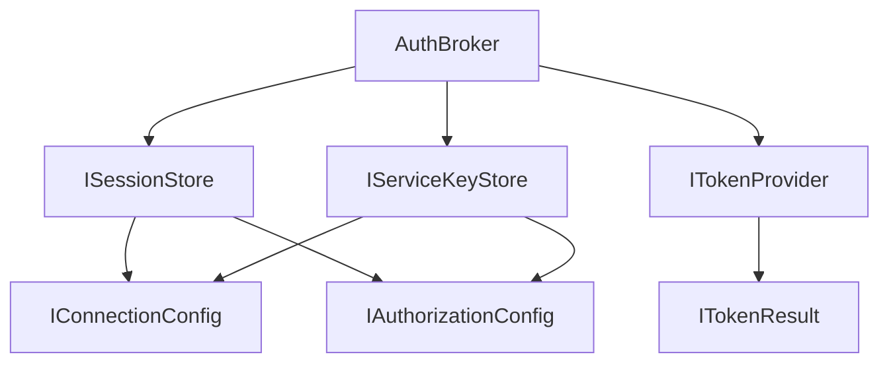

# Exported Entities

This document lists the public exports of `@mcp-abap-adt/auth-broker` and how they relate.

## Primary Exports

### `AuthBroker`
Main orchestrator for token retrieval and refresh.

**Export**:
```typescript
export { AuthBroker, type AuthBrokerConfig } from './AuthBroker';
```

**Key methods**:
- `getToken(destination: string): Promise<string>`
- `refreshToken(destination: string): Promise<string>`
- `getAuthorizationConfig(destination: string): Promise<IAuthorizationConfig | null>`
- `getConnectionConfig(destination: string): Promise<IConnectionConfig | null>`
- `createTokenRefresher(destination: string): ITokenRefresher`

### Interfaces (for consumers)

These are the stable interfaces consumers should use.

```typescript
export type {
  IAuthorizationConfig,
  IConnectionConfig,
  IServiceKeyStore,
  ISessionStore,
} from './stores/interfaces';
```

```typescript
export type { IConfig } from './types';
```

### Provider Interface

`ITokenProvider` is the contract for token acquisition.

```typescript
export type {
  ITokenProvider,
  ITokenResult,
  TokenProviderOptions,
} from './providers';
```

**ITokenProvider shape** (from `@mcp-abap-adt/interfaces`):
```typescript
export interface ITokenProvider {
  getTokens(): Promise<ITokenResult>;
  validateToken?(token: string, serviceUrl?: string): Promise<boolean>;
}
```

### Convenience Re-exports

```typescript
export type { AuthType, ILogger, ITokenRefresher } from '@mcp-abap-adt/interfaces';
```

## External Implementations

Concrete implementations are **not** in this package:
- Stores live in `@mcp-abap-adt/auth-stores`.
- Providers live in `@mcp-abap-adt/auth-providers`.

## Minimal Relationship Diagram


