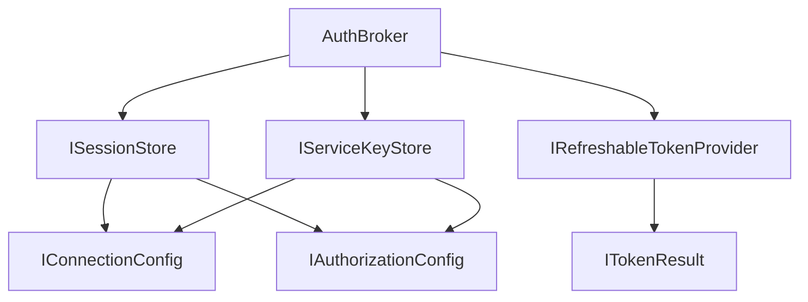

# Exported Entities

This document lists the public exports of `@mcp-abap-adt/auth-broker` and how they relate.

## Primary Exports

### `AuthBroker`
Main orchestrator for token retrieval and refresh.

**Export**:
```typescript
export {
  AuthBroker,
  type AuthBrokerConfig,
  type TokenProviderFactory,
} from './AuthBroker';
```

**Constructor**: `new AuthBroker({ sessionStore, serviceKeyStore?, provider }, logger?)`, where
`provider` is an `IRefreshableTokenProvider` or a `TokenProviderFactory`
`(destination, authConfig, connConfig) => IRefreshableTokenProvider`.

**Key methods**:
- `getToken(destination: string): Promise<string>`
- `refreshToken(destination: string): Promise<string>` — a forced refresh (`provider.refreshTokens()`)
- `getAuthorizationConfig(destination: string): Promise<IAuthorizationConfig | null>`
- `getConnectionConfig(destination: string): Promise<IConnectionConfig | null>`
- `createTokenRefresher(destination: string): ITokenRefresher`

### Interfaces (for consumers)

These are the stable interfaces consumers should use.

```typescript
export type {
  IAuthorizationConfig,
  IConnectionConfig,
  IServiceKeyStore,
  ISessionStore,
} from './stores/interfaces';
```

```typescript
export type { IConfig } from './types';
```

### Provider Interface

`IRefreshableTokenProvider` is what the broker requires; `ITokenProvider` is its base.

```typescript
export type {
  IRefreshableTokenProvider,
  ITokenProvider,
  ITokenResult,
  TokenProviderOptions,
} from './providers';
```

**Shapes** (from `@mcp-abap-adt/interfaces-auth` 2.1.0):
```typescript
export interface ITokenProvider {
  getTokens(): Promise<ITokenResult>;
  validateToken?(token: string, serviceUrl?: string): Promise<boolean>;
}

export interface IRefreshableTokenProvider extends ITokenProvider {
  /** A new token, never the cached one. */
  refreshTokens(): Promise<ITokenResult>;
}
```

### Convenience Re-exports

```typescript
export type { ITokenRefresher } from '@mcp-abap-adt/interfaces-auth';
export type { AuthType } from '@mcp-abap-adt/interfaces-auth-sap';
export type { ILogger } from '@mcp-abap-adt/interfaces-utils';
```

## External Implementations

Concrete implementations are **not** in this package:
- Stores live in `@mcp-abap-adt/auth-stores`.
- Providers live in `@mcp-abap-adt/auth-providers`.

## Minimal Relationship Diagram


```mermaid
flowchart TD
  AB[AuthBroker] --> SS[ISessionStore]
  AB --> SK[IServiceKeyStore]
  AB --> TP[IRefreshableTokenProvider]
  SS --> IConn[IConnectionConfig]
  SS --> IAuth[IAuthorizationConfig]
  SK --> IConn
  SK --> IAuth
  TP --> IToken[ITokenResult]
```
