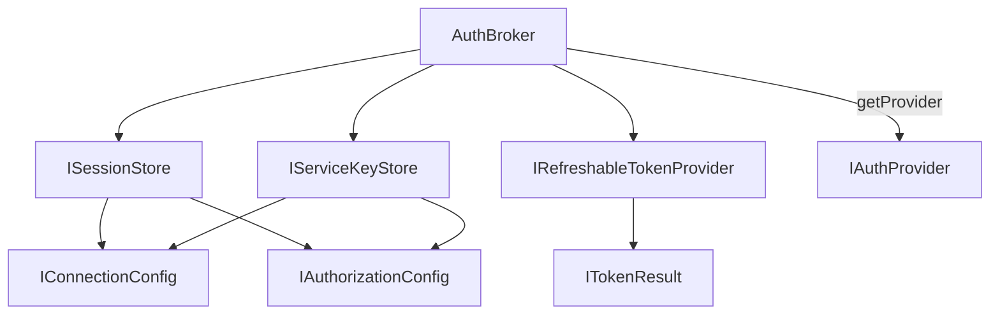

# Exported Entities

This document lists the public exports of `@mcp-abap-adt/auth-broker` and how they relate.

## Primary Exports

### `AuthBroker`
Main orchestrator for token retrieval and refresh.

**Export**:
```typescript
export {
  AuthBroker,
  type AuthBrokerConfig,
  type StrategyGrant,
  type TokenProviderFactory,
} from './AuthBroker';
```

**Constructor**: `new AuthBroker({ sessionStore, serviceKeyStore?, provider?, …collaborators }, logger?)`, where
`provider` — a token API source of your own, optional, never used by
`getProvider`; without it the token API asks `getProvider`'s provider — is an
`IRefreshableTokenProvider` or a `TokenProviderFactory`
`(destination, authConfig, connConfig) => IRefreshableTokenProvider`. The
collaborator options (`authorization`, `oidcAuthorization`,
`deviceCodePresenter`, `samlCookies`, `assertionReplayStore`) are each a
function of the destination; `StrategyGrant` is the grant `authorization` is
called with (`'authorization_code' | 'passcode' | 'saml2_pure' | 'saml2_bearer'`).
Each is required only by the destination rows that use it: `authorization`
by `authorization_code`, `passcode`, `saml2_pure`, `saml2_bearer`;
`oidcAuthorization` by `oidc_authorization_code`; `deviceCodePresenter` by
`device_code`; `samlCookies` by `saml2_pure`; `assertionReplayStore` by both
SAML grants. Their types come from the packages that declare them:
`IAuthorizationStrategy`, `IAssertionReplayStore` from
`@mcp-abap-adt/interfaces-auth`; `OidcCallbackResult`, `IDeviceCodePresenter`
from `@mcp-abap-adt/auth-providers` — none is re-exported here.

**Key methods**:
- `getProvider(destination: string): Promise<IAuthProvider>` — the provider the destination states, from the key store's means and the session's secret — the secret used only when its `issuedFor` / `issuedBy` are the destination's; cached per destination
- `getToken(destination: string): Promise<string>` — the token of the destination's provider (`getProvider`'s, shared; or the `provider` option's); refuses a destination stated `basic` or `snc`
- `refreshToken(destination: string): Promise<string>` — a forced refresh (`provider.refreshTokens()`), joining a renewal in flight
- `getAuthorizationConfig(destination: string): Promise<IAuthorizationConfig | null>` — the key store's client with the session's refresh token
- `getConnectionConfig(destination: string): Promise<IConnectionConfig | null>` — the key store's means with the session's secret and its binding (`issuedFor`, `issuedBy`)
- `createTokenRefresher(destination: string): ITokenRefresher` — `getToken` / `refreshToken` bound to one destination; unchanged since 3.x, not deprecated
- `flush(): Promise<void>` — one more attempt for every session write left pending (by `getProvider`'s providers or the token API); rejects with an `AggregateError` naming the destinations still failing

### `bindingOf`

**Export**:
```typescript
export { bindingOf, type SecretBinding } from './bindingOf';

function bindingOf(
  means: IConnectionConfig,
  client?: IAuthorizationConfig | null,
): SecretBinding; // { issuedFor?: string; issuedBy?: string }
```

For a consumer that hands over a credential (a `none` destination's token or
cookies) and writes it to the session store itself: the binding to write beside
it — canonical, and computed by the same function `getProvider` checks against
and `persist` writes, so the two cannot diverge. `means` are the key store's;
`client` its client, when the destination has one. `{}` for a destination that
states no `jwt` / `saml` type or no grant.

### `DestinationConfigError`
What `getProvider` and the token API throw for a destination that lacks what
its type needs — and the token API for one stated `basic` or `snc`
(`authType`), a `none` one without a `provider` option (`provider`), or
neither a `provider` nor a `serviceKeyStore` (both).

**Export**:
```typescript
export { DestinationConfigError } from './DestinationConfigError';
```

**Shape**:
```typescript
class DestinationConfigError extends Error {
  readonly code: 'DESTINATION_CONFIG';
  readonly destination: string;
  readonly missingFields: string[]; // field or option names only, never a value
}                                   // no cause: a provider's error quotes values
```

`IAuthProvider` is not re-exported: take it from `@mcp-abap-adt/interfaces-auth`.

### Interfaces (for consumers)

These are the stable interfaces consumers should use. The store contracts
(`IConnectionConfig`, `IServiceKeyStore`, `ISessionStore`, and `IConfig` below)
come from `@mcp-abap-adt/interfaces-auth-broker` 1.0.0; `IAuthorizationConfig`
from `@mcp-abap-adt/interfaces-auth-sap` 2.0.0.

```typescript
export type {
  IAuthorizationConfig,
  IConnectionConfig,
  IServiceKeyStore,
  ISessionStore,
} from './stores/interfaces';
```

```typescript
export type { IConfig } from './types';
```

### Provider Interface

`IRefreshableTokenProvider` is what the broker requires; `ITokenProvider` is its base.

```typescript
export type {
  IRefreshableTokenProvider,
  ITokenProvider,
  ITokenResult,
  TokenProviderOptions,
} from './providers';
```

**Shapes** (from `@mcp-abap-adt/interfaces-auth` 3.0.0):
```typescript
export interface ITokenProvider {
  getTokens(): Promise<ITokenResult>;
  validateToken?(token: string, serviceUrl?: string): Promise<boolean>;
}

export interface IRefreshableTokenProvider extends ITokenProvider {
  /** A new token, never the cached one. */
  refreshTokens(): Promise<ITokenResult>;
}
```

### Convenience Re-exports

```typescript
export type { ITokenRefresher } from '@mcp-abap-adt/interfaces-auth';
export type { AuthType } from '@mcp-abap-adt/interfaces-auth-sap';
export type { ILogger } from '@mcp-abap-adt/interfaces-utils';
```

## External Implementations

Concrete implementations are **not** in this package:
- Stores live in `@mcp-abap-adt/auth-stores`.
- Providers live in `@mcp-abap-adt/auth-providers` — a runtime dependency,
  since `getProvider` builds `BasicAuthProvider`, `SncLogonProvider`,
  `TokenAuthProvider`, `SamlAuthProvider`, `AuthorizationCodeProvider`,
  `ClientCredentialsProvider` and `UaaPasscodeProvider`; none of them is
  re-exported.

## Minimal Relationship Diagram


```mermaid
flowchart TD
  AB[AuthBroker] --> SS[ISessionStore]
  AB --> SK[IServiceKeyStore]
  AB --> TP[IRefreshableTokenProvider]
  AB -->|getProvider| AP[IAuthProvider]
  SS --> IConn[IConnectionConfig]
  SS --> IAuth[IAuthorizationConfig]
  SK --> IConn
  SK --> IAuth
  TP --> IToken[ITokenResult]
```
