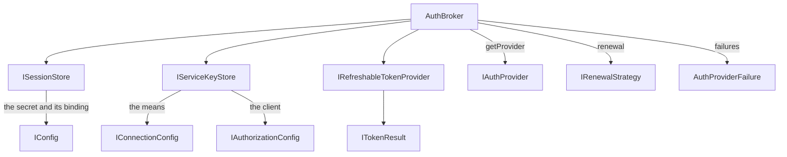

# Exported Entities

This document lists the public exports of `@mcp-abap-adt/auth-broker` 5.0.0 (`src/index.ts`) and how they relate.

## Primary Exports

### `AuthBroker`

The credential a destination states (`getProvider`), its persistence, and the token API.

```typescript
export {
  AuthBroker,
  type AuthBrokerConfig,
  type BrokerCallOptions,
  type StrategyGrant,
  type TokenProviderClient,
  type TokenProviderFactory,
} from './AuthBroker';
export type { TokenGrant } from './destinations';
```

**Constructor**: `new AuthBroker(config: AuthBrokerConfig, logger?: ILogger)`:

| Option | What it is |
|---|---|
| `sessionStore` (required) | the secret and its binding: `ISessionStore` |
| `serviceKeyStore` | the means: `IServiceKeyStore`; `getProvider` needs it |
| `provider` | the token API's own source (the consumer path): an `IRefreshableTokenProvider` or a `TokenProviderFactory` `(destination, authConfig, connConfig, client?) => IRefreshableTokenProvider` — handed the means and the client, never a stored secret; never used by `getProvider` |
| `authorization`, `oidcAuthorization`, `deviceCodePresenter`, `samlCookies`, `assertionReplayStore` | the collaborators, each a function of the destination, called once per build, required only by the rows that use them; `StrategyGrant` (`'authorization_code' \| 'passcode' \| 'saml2_pure' \| 'saml2_bearer'`) is the grant `authorization` is called with |
| `clientAuthentication` | a `ClientAuthenticationStrategy`: how a client authenticates |
| `renewal` | `(destination, grant: TokenGrant) => IRenewalStrategy` — required by every token row; no default |
| `onWriteFailure` | `'fail' \| 'continue'` — required by every destination that writes a secret; no default |
| `authDebug` | `boolean` — passed to every token provider the broker builds; on only for `true` |

`TokenGrant` is `'authorization_code' | 'client_credentials' | 'passcode' | 'oidc_authorization_code' | 'device_code' | 'password' | 'token_exchange' | 'saml2_pure' | 'saml2_bearer'` — every
grant a destination may state but `'none'`. `BrokerCallOptions` is
`{ readonly signal?: AbortSignal | undefined }`. `TokenProviderClient` — the factory's fourth
argument, only beside a `clientAuthentication` strategy for a grant that authenticates a client:
`clientAuthentication`, `uaaUrl`, `clientId`; never a certificate, key, secret or refresh token
(`refreshToken` stays in the type and is never set). The collaborators' types come from the
packages that declare them: `IAuthorizationStrategy`, `IAssertionReplayStore` from
`@mcp-abap-adt/interfaces-auth`; `OidcCallbackResult`, `IDeviceCodePresenter` from
`@mcp-abap-adt/auth-providers` — none is re-exported here.

**Methods**:

- `getProvider(destination, options?: BrokerCallOptions): Promise<IAuthProvider>` — the provider the destination states, from the key store's means and the session's secret (used only when bound to exactly this build); rebuilt when what it was built from changes; the signal attached to a token or SNC provider
- `getToken(destination, options?): Promise<string>` — the token of the destination's provider (the row path's, or the `provider` option's); refuses a destination stated `basic` or `snc`
- `refreshToken(destination, options?): Promise<string>` — a forced refresh (`refreshTokens()`), joining a renewal in flight
- `flush(options?): Promise<void>` — one more attempt for every pending session write; rejects with an `AggregateError` of `SessionWriteFailure`s
- `createTokenRefresher(destination, options?): ITokenRefresher` — `getToken` / `refreshToken` bound to one destination and signal
- `getAuthorizationConfig(destination): Promise<IAuthorizationConfig | null>` — the key store's client with the session's refresh token
- `getConnectionConfig(destination): Promise<IConnectionConfig | null>` — the key store's means with the session's secret and its binding (`issuedFor`, `issuedBy`)

### Errors

```typescript
export {
  DestinationConfigError,
  type DestinationConfigErrorLike,
  isDestinationConfigError,
} from './DestinationConfigError';
export { SessionWriteFailure } from './SessionWriter';
```

```typescript
import type { DestinationConfigErrorLike } from '@mcp-abap-adt/auth-broker';
import type { IAuthProviderError } from '@mcp-abap-adt/interfaces-auth';

declare class DestinationConfigError extends Error {
  readonly name: 'DestinationConfigError';
  readonly code: 'DESTINATION_CONFIG';
  readonly destination: string;
  readonly missingFields: string[];          // store field or broker option names, never a value
  readonly error?: IAuthProviderError;       // the provider's or strategy's failure, when one caused it
}

/** Structural (own data name, code, destination, missingFields); no instanceof; true for a JSON copy. */
declare function isDestinationConfigError(value: unknown): value is DestinationConfigErrorLike;

declare class SessionWriteFailure extends Error { // one per destination in flush()'s AggregateError
  readonly name: 'SessionWriteFailure';
  readonly destination: string;
  readonly error: IAuthProviderError;        // classify(storeError, 'persisting-tokens')
}
```

Every other failure the broker relays or makes is an `AuthProviderFailure` of
`@mcp-abap-adt/auth-errors` (read with `readFailure` / `isAuthProviderFailure` there).

### Client authentication

```typescript
export {
  type ClientAuthenticationContext,
  type ClientAuthenticationGrant,
  type ClientAuthenticationStrategy,
  type FromServiceKeySecretOptions,
  fromServiceKeyCertificate,
  fromServiceKeySecret,
} from './clientAuthentication';
```

`ClientAuthenticationStrategy` is `(context: ClientAuthenticationContext) =>
Promise<IClientAuthentication>`, called once per build of a destination whose grant
(`ClientAuthenticationGrant`: the UAA and OIDC grants, `saml2_bearer`) authenticates a client; the
context carries `destination`, `grant`, `client` (the key store's secret client — `uaaUrl`,
`uaaClientId`, `uaaClientSecret` only — or `null`), a lazy `readCertificate()` and `signal` (the
build's attempt). `fromServiceKeyCertificate()` answers auth-providers' `tlsClientCertificate`
from the key store's certificate client (`<certUrl>/oauth/token`, material checked before
answering); `fromServiceKeySecret({ encoding: 'raw' | 'form' })` its `clientSecretBasic`. The
broker turns any throw into a `DestinationConfigError` naming `clientAuthentication`.

### `bindingOf`

```typescript
export { bindingOf, type SecretBinding } from './bindingOf';

declare function bindingOf(
  means: IConnectionConfig,
  client?: IAuthorizationConfig | null,
): SecretBinding; // { issuedFor?: string; issuedBy?: string }
```

For a consumer that hands over a credential (a `none` destination's token or cookies) and writes
it to the session store itself: `issuedFor` (the canonical resource) and `issuedBy` (the
version-2 record of the row the means state) — exactly what `getProvider` compares. `{}` for a
destination that states no `jwt` / `saml` type or no grant.

### Store contracts (for consumers)

The store contracts come from `@mcp-abap-adt/interfaces-auth-broker` 1.3, `IAuthorizationConfig`
from `@mcp-abap-adt/interfaces-auth-sap` 3:

```typescript
export type {
  IAuthorizationConfig,
  IConnectionConfig,
  IServiceKeyStore,
  ISessionStore,
} from './stores/interfaces';
export type { IConfig } from './types';
```

### Token provider contracts

`IRefreshableTokenProvider` is what the token API requires of a `provider` you give it;
`ITokenProvider` is its base. `getProvider` hands out an `IAuthProvider` (not re-exported: take
it from `@mcp-abap-adt/interfaces-auth`).

```typescript
export type {
  IRefreshableTokenProvider,
  ITokenProvider,
  ITokenResult,
  TokenProviderOptions,
} from './providers';
```

### Convenience re-exports

```typescript
export type {
  IClientAuthentication,
  IRenewalStrategy,
  ITokenRefresher,
} from '@mcp-abap-adt/interfaces-auth';
export type { IClientCertificate } from '@mcp-abap-adt/interfaces-auth-broker';
export type { AuthType } from '@mcp-abap-adt/interfaces-auth-sap';
export type { ILogger } from '@mcp-abap-adt/interfaces-utils';
```

## External Implementations

Concrete implementations are **not** in this package:

- Stores live in `@mcp-abap-adt/auth-stores` (4 for this version).
- Providers live in `@mcp-abap-adt/auth-providers` 6 — a runtime dependency, since `getProvider`
  builds `BasicAuthProvider`, `SncLogonProvider`, `TokenAuthProvider`, `SamlAuthProvider`,
  `AuthorizationCodeProvider`, `ClientCredentialsProvider`, `UaaPasscodeProvider`,
  `OidcBrowserProvider`, `OidcDeviceFlowProvider`, `OidcPasswordProvider`,
  `OidcTokenExchangeProvider`, `Saml2PureProvider` and `Saml2BearerProvider` (with the SAML
  validators it composes and `refreshStatePersistence`); none of them is re-exported. The
  renewal strategies (`refreshThenLogin`, `refreshOnly`) and the interactive strategies are
  imported from there by the consumer.
- Failures and their reading live in `@mcp-abap-adt/auth-errors` 2.

## Minimal Relationship Diagram


```mermaid
flowchart TD
  AB[AuthBroker] --> SS[ISessionStore]
  AB --> SK[IServiceKeyStore]
  AB --> TP[IRefreshableTokenProvider]
  AB -->|getProvider| AP[IAuthProvider]
  AB -->|renewal| RS[IRenewalStrategy]
  AB -->|failures| AE[AuthProviderFailure]
  SS -->|the secret and its binding| ICfg[IConfig]
  SK -->|the means| IConn[IConnectionConfig]
  SK -->|the client| IAuth[IAuthorizationConfig]
  TP --> IToken[ITokenResult]
```
